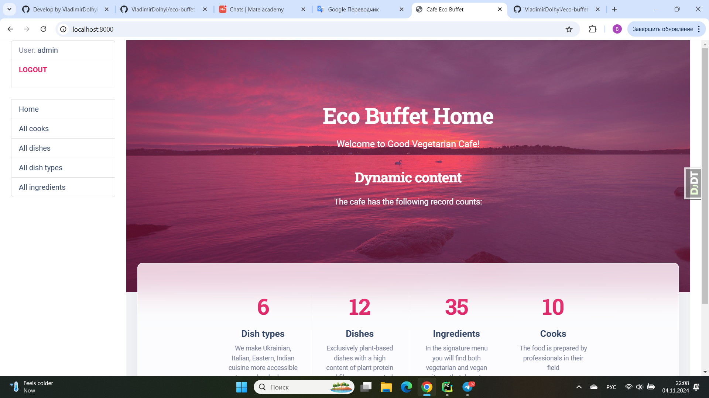
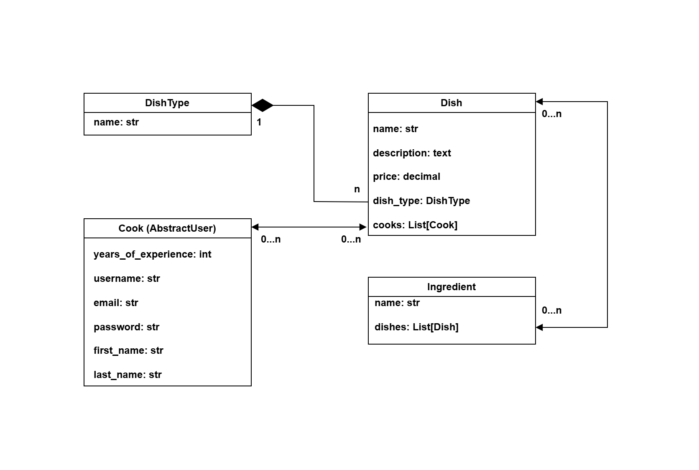

# Restaurant Kitchen Service
## Cafe Eco Buffet

### Description
Project for managing local cafe with cooks, dishes, dish types and ingredients.

Purpose is to improve the communication & rules between cooks on the kitchen.

This is build management system, in which Cooks can create new Dishes & Dish types with Ingredients,
and also specify, Cooks which are responsible for every Dishes cooking.

You are able to create, update and delete any items.

## Used technologies:

- ✅ Programming language: Python 3.11.4
- ✅ Database: `sqlite`
- ✅ Framework: Django 5.1.1
- ✅ Version control system: Git

<br />

## ✨ How to use it

> Download the code 

```bash
$ # Get the code
$ git clone https://github.com/VladimirDolhyi/eco-buffet.git
$ cd eco_buffet
```

<br />

### 👉 Set Up for `MacOS` 

> Install modules via `VENV`  

```bash
$ virtualenv env
$ source env/bin/activate
$ pip3 install -r requirements.txt
```

<br />

> Set Up Database

```bash
$ python manage.py makemigrations
$ python manage.py migrate
```

<br />

> Run the server

```bash
$ python manage.py runserver
```

<br />

### 👉 Set Up for `Windows` 

> Install modules via `VENV` (windows) 

```
$ virtualenv env
$ .\env\Scripts\activate
$ pip3 install -r requirements.txt
```

<br />

> Set Up Database

```bash
$ python manage.py makemigrations
$ python manage.py migrate
```

<br />

> Run the server

```bash
$ python manage.py runserver
```

<br />

### 👉 Home page


### 👉 Database Schema

