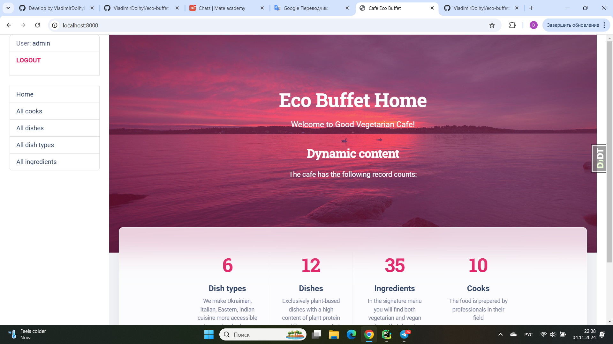
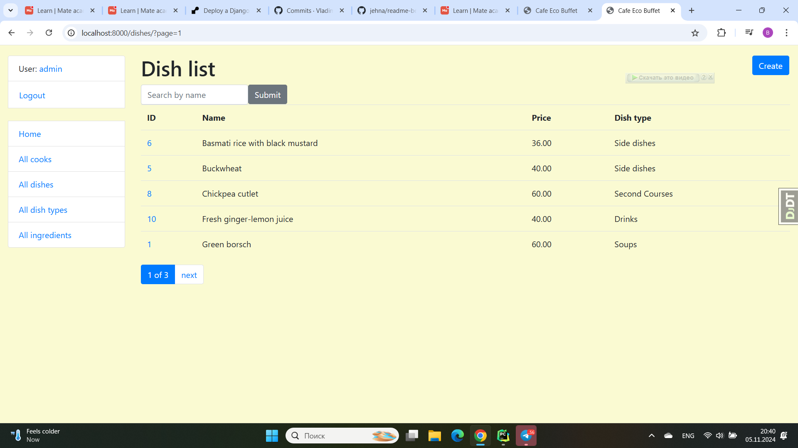

# Restaurant Kitchen Service
## Cafe Eco Buffet

### 👉 Description
Project for managing local cafe with cooks, dishes, dish types and ingredients.

Purpose is to improve the communication & rules between cooks on the kitchen.

This is build management system, in which Cooks can create new Dishes & Dish types with Ingredients,
and also specify, Cooks which are responsible for every Dishes cooking.

You are able to create, update and delete any items.

### 👉 Check it out!

[Cafe project deployed to Render](https://eco-buffet.render.com/)

### 👉 Installation

Python3 must be already installed

### ✨ How to use it

> Download the code 

```bash
$ # Get the code
$ git clone https://github.com/VladimirDolhyi/eco-buffet.git
$ cd eco_buffet
```

#### 👉 Set Up

> Install modules via `VENV`  

```bash
$ python -m venv venv
$ source venv/bin/activate (on macOS)
$ venv\Scripts\activate (on Windows)
$ pip install -r requirements.txt
```

> Set Up Database

```bash
$ python manage.py makemigrations
$ python manage.py migrate
```
> Run the server

```bash
$ python manage.py runserver
```

### 👉 Features

* Authentication functionality for Cook/User
* Managing dishes, cooks, dish types & ingredients directly from website interface
* Powerful admin panel for advanced managing

### 👉 Home page


### 👉 Database Schema


### 👉 Demo
